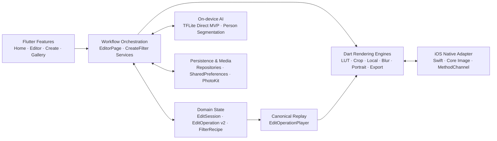

<div align="center">

# Memoria

### 기억의 색을 직접 만들고, 비파괴 방식으로 편집하는 온디바이스 포토 에디터

[](https://github.com/cres17/memoria/actions/workflows/ios-build.yml)


[](LICENSE)

**Fuji·Leica LUT · 로컬 보정 · 비파괴 편집 이력 · 온디바이스 커스텀 필터**

</div>

> [!IMPORTANT]
> Memoria는 현재 **iOS 우선 내부 베타**입니다. Android 소스는 포함되어 있지만 이번 릴리스 사이클의 실기기·스토어 승인은 iOS보다 부족합니다. 상세 상태는 [퍼블리시 체크리스트](PUBLISH_CHECKLIST.md)를 기준으로 관리합니다.

## 무엇을 만들었나요?

Memoria는 사진을 서버로 보내지 않고 기기에서 편집하는 Flutter 앱입니다. 고정 프리셋을 고르는 데서 끝나지 않고, 사용자가 선택한 참조 사진의 색감을 분석해 재사용 가능한 LUT 필터로 만드는 흐름까지 한 앱 안에 연결했습니다.

| 영역 | 제공 기능 |
|---|---|
| 필름 룩 | Original, Fuji 18종, Leica 5종, 실제 65³ LUT, 고정 장면 썸네일, 필터 강도 조절 |
| 기본 보정 | 노출, 대비, 색온도, HSL, 커브, 디테일, 그레인, 글로우, 비네팅, 스플릿 톤 |
| 크리에이티브 | 드라마·HDR 룩, 광학 유출, 할레이션, 이중 노출, 프레임, 텍스트 오버레이 |
| 공간 편집 | 자유/비율 크롭, 회전, 좌우·상하 반전, 원근, 검정·흰색 캔버스 확장 |
| 로컬 편집 | 지점 부분 보정, dodge/burn 브러시, 선형 틸트 시프트, 원형 초점 흐림 |
| 인물 영역 | 온디바이스 사람 분할 마스크 기반 부드럽게·밝기·색조 조정 |
| 필터 생성 `BETA` | 단일 참조 Direct MVP, Before/After fitting, 다중 참조 스타일 융합 |
| 내보내기 | JPEG, PNG, TIFF, iOS WebP, 품질 설정, 진행 표시, 취소와 임시 파일 정리 |

인물 보정은 현재 얼굴 피부 전용 모델이 아니라 **사람 영역 분할**을 사용합니다. 원형 초점 흐림도 실제 카메라 depth가 아닌 중심 거리 기반 효과입니다. 힐링/클론과 진짜 RAW/DNG 현상은 현재 제품 기능으로 노출하지 않습니다.

## 아키텍처

Memoria는 기능 화면, 편집 도메인 상태, 순수 Dart 렌더 엔진, 네이티브/AI 어댑터를 분리합니다. `EditSession`과 schema v2 `EditOperation`이 undo/redo와 draft 복원의 기준이 되고, `EditOperationPlayer`가 같은 operation을 다시 재생할 수 있도록 설계했습니다.



### 레이어별 역할

| 레이어 | 주요 경로 | 역할 |
|---|---|---|
| Presentation | `lib/features`, `lib/core/shell` | 편집 UI, 도구 transaction, 탐색과 사용자 피드백 |
| Domain | `lib/domain/models`, `lib/domain/repositories` | 편집 operation/session, 필터 레시피와 저장 계약 |
| Rendering | `lib/engine` | LUT 보간, 색 보정, 로컬 마스크, 블러, 프레임, 텍스트, export encoding |
| AI | `lib/ai`, `assets/models` | 번들 TFLite 모델 검증·설치, LUT 예측, 사람 영역 분할 |
| Data & Platform | `lib/data`, `lib/core/services`, `ios/Runner` | draft/설정 저장, 미디어 권한, Photos/share, Swift Core Image 가속 |
| ML Pipeline | `ml_pipeline` | 데이터 감사, family holdout, 학습·평가, ONNX/TFLite 변환과 벤치마크 |

### 주요 설계 원칙

- **비파괴 편집**: 원본 대신 operation과 효과 상태를 저장하고 undo/redo 및 draft 복원에 사용합니다.
- **Preview/Export 일관성**: 편집 레시피를 재생 가능한 형태로 유지해 미리보기와 전체 해상도 렌더의 차이를 줄입니다.
- **온디바이스 우선**: LUT 예측과 사람 분할을 TFLite로 실행하며 번들 모델의 크기와 SHA-256을 검증합니다.
- **무거운 작업 격리**: 필터 생성과 전체 해상도 렌더를 isolate에서 실행하고 진행·취소 상태를 UI에 전달합니다.
- **실패 관측 가능성**: Flutter/platform error boundary와 기기 내 최대 500줄 진단 로그를 사용합니다.
- **출시 게이트**: analyzer, 테스트, 필수 asset 검사, CocoaPods lock, iOS simulator/release 빌드를 GitHub Actions에서 확인합니다.

## 기술 스택

| 범주 | 기술 |
|---|---|
| App | Flutter 3.44.6, Dart 3.12.2, Material |
| State & Navigation | Riverpod, GoRouter |
| Image | Dart `image`, custom 65³ LUT engine, fragment shader |
| Native iOS | Swift, Core Image, Flutter MethodChannel, PhotoKit |
| AI | TensorFlow Lite, Direct MVP 17³ LUT decoder, MediaPipe segmentation |
| Storage | SharedPreferences, JSON schema v2, local app-support diagnostics |
| Quality | Flutter Test, Integration Test, white-box fixtures, performance gate |
| Automation | GitHub Actions, CocoaPods lockfile, unsigned iOS release artifact |

## 프로젝트 구조

```text
lib/
├── ai/                 # 모델 설치·상태 및 TFLite inference adapters
├── core/               # 라우팅, 테마, 오류 처리, 권한·내보내기 설정
├── data/               # 세션·즐겨찾기·사용자 보정 저장소
├── domain/             # 편집 operation/session과 필터 도메인 계약
├── engine/             # 이미지 처리 및 내보내기 엔진
├── features/           # Home, Editor, Create Filter, Gallery, Settings
└── monetization/       # 광고 feature flag와 서비스
ios/Runner/             # Swift LUT/Core Image 플러그인과 iOS 앱 설정
ml_pipeline/            # 학습·평가·배포 변환 파이프라인
integration_test/       # 실제 EditorPage 화이트박스·성능 시나리오
test/                   # unit/widget/contract 회귀 테스트
```

## 시작하기

### 요구 환경

- Flutter `3.44.6`
- Dart `3.12.2`
- iOS 실행 시 최신 Xcode와 CocoaPods

```bash
git clone https://github.com/cres17/memoria.git
cd memoria
flutter pub get --enforce-lockfile
flutter run -d <device-id>
```

iOS 의존성을 직접 동기화할 때는 다음 명령을 사용합니다.

```bash
cd ios
pod install --deployment
cd ..
```

## 검증

```bash
flutter analyze --no-fatal-infos
flutter test --coverage --reporter compact
flutter test integration_test/editor_whitebox_device_test.dart \
  -d <ios-simulator-id>
flutter drive --profile \
  --driver test_driver/editor_performance_driver.dart \
  --target integration_test/editor_performance_test.dart \
  -d <physical-ios-device-id> --publish-port
```

시뮬레이터 debug 성능 수치는 회귀 확인용입니다. 최종 latency와 peak memory 승인은 profile/release 실기기 보고서만 사용합니다.

## 현재 품질 상태

- 현재 전체 unit/widget suite: **460 tests passed**, 조건부 fixture 1건 skip
- iPhone 17 Pro 시뮬레이터 EditorPage white-box: **3 scenarios passed**
- iOS simulator debug 및 unsigned release build: **passed**
- 공식 실기기 profile 성능, 완주 export, Photos/share 검증: **pending**

세부 근거와 남은 작업은 다음 문서에서 확인할 수 있습니다.

- [퍼블리시 체크리스트](PUBLISH_CHECKLIST.md)
- [최종 프로덕션 준비도 감사](docs/final-production-readiness-review.md)
- [편집기 화이트박스 검증 계획](docs/editor-whitebox-validation-plan.md)
- [온디바이스 참조 룩 설계](docs/on-device-reference-look-design.md)

## 라이선스

Memoria는 [MIT License](LICENSE)로 배포됩니다. Maintainer: [@cres17](https://github.com/cres17)
