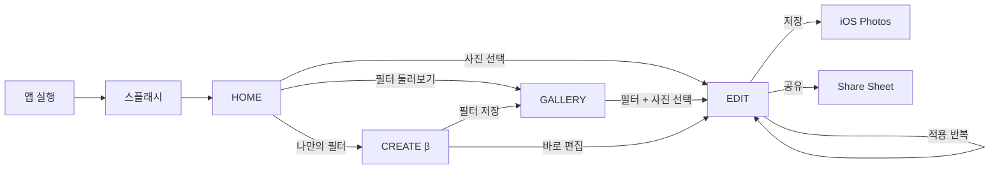
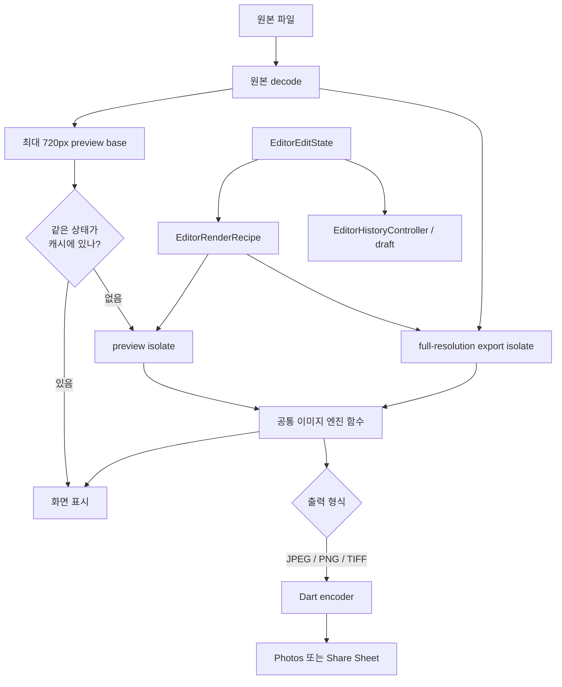
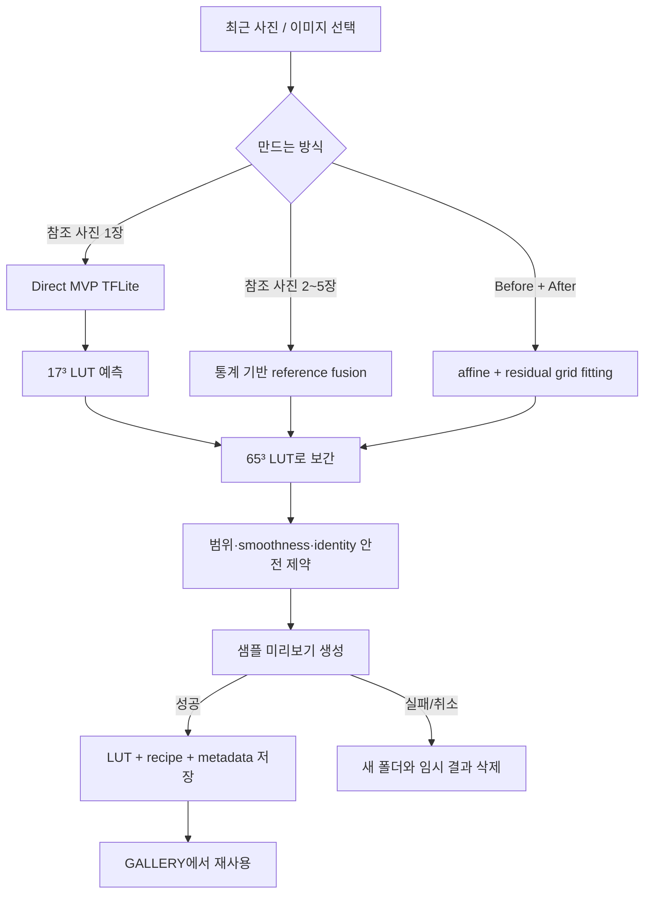

<div align="center">

# Memoria

사진을 고르고, 색을 만들고, 다시 꺼내 쓸 수 있게 하는 모바일 사진 편집기

[](https://github.com/cres17/memoria/actions/workflows/ios-build.yml)


[](LICENSE)

</div>

Memoria가 하려는 일은 단순합니다. 사진에 필터를 한 번 씌우고 끝내는 대신, 한 장을 고르는 순간부터 보정하고 되돌리고 저장하는 과정까지 자연스럽게 이어지게 만드는 것입니다. 마음에 드는 사진의 색을 새 필터로 만들어 다음 사진에 다시 쓰는 기능도 같은 흐름 안에 넣었습니다.

현재 release 후보는 iOS를 기준으로 검증합니다. Android 프로젝트도 함께 들어 있지만, 스토어 제출 전에는 Android signing·실기기 export도 별도로 통과해야 합니다. 릴리스 상태와 남은 외부 설정은 [`architecture-connectivity-code-quality-review.md`](docs/architecture-connectivity-code-quality-review.md)에서 관리합니다.

## 앱을 켜면 이렇게 흘러갑니다



### 1. 앱이 뜨는 동안

[`main.dart`](lib/main.dart)는 전역 Flutter/플랫폼 오류 경계를 설치한 뒤 즉시 화면을 그립니다. 오류 로그 저장소, GPU fallback, 저장 언어, 화면 방향·system UI, 커스텀 필터 모델, 인물 분할 모델과 개발용 광고 SDK는 첫 frame 뒤의 이름 있는 초기화 단계로 실행됩니다. 각 단계의 실패는 개별 기록되므로 앞 단계 하나가 실패해도 뒤 초기화는 계속됩니다.

Flutter 오류와 플랫폼 오류는 [`ErrorLogger`](lib/core/error/error_handler.dart)로 모읍니다. 최근 500줄만 앱 지원 디렉터리에 남기며 사진이나 편집 결과를 서버로 전송하지 않습니다.

### 2. HOME에서 사진을 고릅니다

[`HomePage`](lib/features/home/home_page.dart)는 `image_picker`로 사용자의 사진을 고른 뒤 파일 경로를 `/editor` route에 전달합니다. 추천 룩을 먼저 고른 경우에는 사진 경로와 `presetId`를 함께 넘겨, 편집기가 열릴 때 해당 필터가 선택된 상태로 시작합니다.

화면 이동은 [`GoRouter`](lib/core/router/app_router.dart)가 맡습니다. HOME과 GALLERY는 하단 내비게이션을 공유하고, EDIT·CREATE·설정은 각각 독립된 화면으로 올라옵니다. iOS에서는 같은 route라도 `CupertinoPage` 전환을 사용합니다.

### 3. EDIT에서 도구를 하나씩 적용합니다

편집 도구는 즉시 확정되지 않습니다. 도구를 열면 현재 상태를 백업하고, 슬라이더나 화면 터치로 바뀐 결과는 미리보기에서만 보입니다.

- 오른쪽 위 체크를 누르면 `_saveToHistory()`가 현재 상태를 operation으로 남깁니다.
- 왼쪽 위 뒤로 가기를 누르면 도구를 열기 전 백업으로 돌아갑니다.
- 초기화는 편집 전체가 아니라 현재 열어 둔 도구만 중립값으로 돌립니다.
- 다른 도구로 바로 이동하면 이전 도구는 암묵적으로 적용하지 않고 취소합니다.
- 편집 화면 자체를 나갈 때는 전체 편집 취소 여부를 다시 묻습니다.

이 transaction 동작은 [`editor_page_history.dart`](lib/features/editor/editor_page_history.dart)의 `_activateTool`, `_cancelActiveTool`, `_resetActiveTool`, `_applyActiveTool`에 모여 있습니다. 필터뿐 아니라 크롭, 인물 영역, 텍스트, 프레임, 부분 보정도 같은 규칙을 따르도록 맞췄습니다.

### 4. 적용한 작업은 되돌릴 수 있습니다

체크를 누를 때 만들어지는 [`EditorStateSnapshot`](lib/features/editor/editor_state_adapter.dart)은 단순히 “밝기 도구를 썼다”는 기록이 아닙니다. 그 시점의 보정값, 필터와 강도, 커브, 크롭·회전·반전, 인물 보정, 텍스트·프레임, 부분 보정 좌표, 브러시 stroke와 블러 상태를 immutable 값으로 보관합니다.

[`EditorHistoryController`](lib/features/editor/editor_history_controller.dart)는 snapshot 목록과 `undoCursor`를 보관합니다. 실행 취소는 목록을 지우는 대신 cursor를 한 칸 뒤로 옮기고, 다시 실행은 앞으로 옮깁니다. 실행 취소 후 새 작업을 적용하면 그 뒤에 있던 redo 구간만 잘라냅니다.

편집 중 앱을 닫아도 돌아올 수 있도록 현재 snapshot은 [`EditorDraftStore`](lib/features/editor/editor_draft_store.dart)를 통해 debounce 후 `SharedPreferences`에 draft로 저장됩니다. draft에는 선택한 필터뿐 아니라 크롭 영역, 캔버스 확장, 브러시 stroke와 로컬 효과도 포함됩니다.

### 5. GALLERY는 사진첩이 아니라 필터 보관함입니다

현재 GALLERY 탭의 역할은 사진 파일을 나열하는 것이 아니라 **Memoria에서 사용할 룩을 모아 두는 것**입니다. [`FiltersPage`](lib/features/filters/filters_page.dart)는 앱에 포함된 Fuji 18종·Leica 5종과 사용자가 만든 필터를 함께 보여줍니다.

필터 카드를 누르면 다시 사진을 고르고, 선택한 `presetId`와 사진 경로를 편집기로 보냅니다. 사용자 필터는 앱 문서 디렉터리의 `filters/<id>/` 아래에 LUT, 썸네일, recipe와 metadata를 보관하며 여기서 삭제할 수 있습니다.

## 사진 한 장은 내부에서 어떻게 처리되나요?

편집 화면에는 속도가 필요한 미리보기와 품질이 필요한 내보내기라는 두 경로가 있습니다. 둘은 같은 `EditorRenderRecipe`와 `EditorRenderer`를 사용하고, 실행 수명주기만 preview scheduler와 export service로 나뉩니다.



### 미리보기 경로

원본은 처음 한 번 decode한 뒤 메모리에 보관합니다. 크롭·회전처럼 사진의 모양을 바꾸는 작업을 먼저 계산하고, 긴 변을 최대 720px로 줄인 preview base를 만듭니다. 이후 LUT, 기본 보정, 예술 효과, 부분 보정, 브러시, 블러, 인물 영역, 이중 노출, 프레임과 텍스트를 [`_previewWorker`](lib/features/editor/editor_page_widgets.dart)에서 처리합니다.

슬라이더 입력은 32ms debounce를 거칩니다. 이미 렌더 중일 때 새 입력이 오면 작업을 무한히 쌓지 않고 마지막 요청 하나만 pending 상태로 남깁니다. 이전 요청의 결과가 늦게 도착하면 render token을 비교해 버립니다. 같은 사진·같은 파라미터 조합은 최대 24개의 LRU 성격 캐시에 보관합니다.

인물 영역 보정이 켜졌을 때만 TFLite segmenter를 실행합니다. interpreter는 isolate 사이에 안전하게 이동할 수 없어서 segmentation은 main isolate에서 처리하고, 결과인 `Float32List` 마스크만 preview worker로 넘깁니다.

### 내보내기 경로

저장할 때는 720px preview를 키우지 않고 원본 파일을 다시 decode합니다. [`EditorExportService`](lib/features/editor/editor_export_service.dart)의 isolate worker가 crop/expand → rotate/flip/perspective → LUT와 색 보정 → 로컬·블러 → 인물 → creative overlay 순으로 전체 해상도에 적용합니다.

JPEG·PNG·TIFF는 [`ExportEncoder`](lib/engine/export_encoder.dart)가 worker 안에서 바로 만듭니다. WebP는 v1 release format이 아닙니다. 지원 여부를 감지하는 native bridge는 미래의 encoder 도입을 위한 안전 경계이며, 지원되지 않은 환경에서는 WebP를 선택할 수 없고 JPEG로 정규화됩니다.

메모리가 부족하면 원본 크기, 긴 변 4096px, 2048px 순으로 다시 시도합니다. 진행률과 취소 신호를 UI에 보내며, 성공·실패·취소 어느 경우든 임시 파일과 isolate를 정리합니다. 최종 파일은 `gal`로 Photos에 저장하거나 `share_plus`로 Share Sheet에 전달합니다.

## 나만의 필터는 어떻게 만들어지나요?

CREATE는 아직 `BETA` 표시를 유지합니다. 화면만 베타인 것이 아니라 생성 결과의 미관과 실기기 성능을 계속 검증하는 단계라는 뜻입니다.



[`CreateFilterPage`](lib/features/create_filter/create_filter_page.dart)는 최근 사진 권한과 선택 상태, 생성 진행률, 성공 sheet를 담당합니다. 실제 생성 작업은 [`IsolateCreateFilterGenerator`](lib/features/create_filter/create_filter_services.dart)가 별도 isolate에서 실행합니다. 45초 timeout, 사용자 취소, worker 비정상 종료를 구분하고 완료되지 않은 필터 디렉터리를 정리합니다.

생성 방식은 세 가지입니다.

1. **참조 사진 한 장**
   번들된 Direct MVP 모델이 256×256 입력에서 17³ LUT를 예측합니다. [`LutPredictor`](lib/ai/models/lut_predictor.dart)가 이를 앱의 표준인 65³, R-fastest 배열로 보간합니다. 모델 파일은 크기와 SHA-256을 확인한 뒤 사용합니다. inference가 실패하면 생성 자체를 막지 않고 알고리즘 경로로 내려가며, 그 이유는 recipe에 남깁니다.

2. **참조 사진 여러 장**
   현재 neural model은 다중 참조를 직접 받지 않습니다. 대신 사진별 색 분포와 룩 거리를 계산하고, 지나치게 다른 참조를 다루는 규칙과 confidence를 포함한 algorithmic fusion을 사용합니다. 제외된 사진 수와 신뢰도는 완료 화면의 안내에도 반영됩니다.

3. **Before / After 한 쌍**
   [`personal_filter_core.dart`](lib/engine/personal_filter_core.dart)가 대응 pixel sample에서 전역 affine color transform을 먼저 맞추고, 남은 오차는 작은 3D residual grid로 학습합니다. ridge regularization, smoothing과 residual clip을 적용한 뒤 65³ LUT로 굽습니다.

세 경로 모두 [`FilterRecipe`](lib/domain/models/filter_recipe.dart)에 생성기 종류, engine/model version, 참조 수, LUT 강도, 안전성 지표와 fallback 이유를 기록합니다. 썸네일 렌더까지 성공해야 [`FilterCommitTransaction`](lib/features/create_filter/create_filter_services.dart)이 metadata index에 필터를 추가합니다.

## 코드 구조

```text
lib/
├── main.dart, app.dart          앱 부팅, 전역 오류 처리, 테마와 router
├── core/                        route, shell, 언어, 테마, 권한·내보내기 설정
├── features/
│   ├── home/                    사진 선택과 시작 화면
│   ├── editor/                  편집 transaction, preview/export orchestration
│   ├── create_filter/           필터 제작 UI와 worker/commit 서비스
│   ├── filters/                 내장·사용자 필터 보관함
│   └── settings/                내보내기와 앱 설정
├── domain/
│   ├── models/                  FilterRecipe와 editor value models
│   └── repositories/            저장 방식과 무관한 repository 계약
├── data/repositories/           JSON 파일·SharedPreferences 저장 구현
├── engine/                      LUT, 색, crop, local, blur, portrait, export
├── ai/                          모델 설치 상태와 TFLite wrapper
└── monetization/                광고 flag와 표시 서비스

ios/Runner/                      Swift MethodChannel과 iOS 설정
assets/luts/                     Fuji·Leica 65³ half-float LUT
assets/models/                   번들 Direct MVP TFLite
ml_pipeline/                     데이터 감사, 학습, holdout 평가, 변환·벤치마크
test/                            unit/widget/contract 테스트
integration_test/                실제 EditorPage 화이트박스·성능 시나리오
```

### 경계가 나뉘는 기준

- `features`는 사용자의 입력과 화면 상태를 다룹니다. 이미지 수학을 직접 구현하지 않는 것이 원칙입니다.
- `engine` 함수는 Flutter widget을 몰라도 실행할 수 있습니다. 그래서 작은 fixture로 빠르게 테스트할 수 있고 isolate에서도 재사용합니다.
- `domain`은 편집 기록과 필터가 어떤 데이터여야 하는지 정의합니다.
- `data`는 그 데이터를 파일이나 preferences에 어떻게 보관할지 결정합니다.
- `ai`는 모델 파일의 생명주기와 tensor 입출력을 감쌉니다. UI는 interpreter shape를 직접 알 필요가 없습니다.
- iOS native 코드는 플랫폼에서만 가능한 변환과 Core Image 실험 경계를 담당합니다.

## 지금 구조를 솔직히 말하면

[`EditorPage`](lib/features/editor/editor_page.dart)는 state/lifecycle 진입점입니다. transaction/history, runtime·preview, controls, shell, menus, widgets는 책임별 파일로 분리되어 private 계약을 보존합니다. 26개 도구 정의는 단일 `EditorToolCatalog`, 임시 적용/취소 수명은 `EditorToolTransactionController`, 실제 편집값은 [`EditorEditState`](lib/features/editor/editor_edit_state.dart)가 소유합니다. immutable 변환은 `EditorStateSnapshot`, export publish는 [`EditorMediaExportCoordinator`](lib/features/editor/editor_media_export_coordinator.dart)가 담당합니다. `CreateFilterPage`도 생성 흐름, 주입 가능한 reference analyzer와 단계/결과 UI를 분리했습니다.

## 지원하는 편집 기능

- **필터**: Original, Fuji 18종, Leica 5종, 사용자 필터, LUT 강도와 즐겨찾기
- **기본 보정**: 노출, 대비, 하이라이트·그림자, 채도, 색온도·틴트, HSL, RGB/휘도 커브
- **디테일과 질감**: 선명도, 구조, clarity, 그레인, 노이즈 감소, 글로우, 비네팅
- **공간 편집**: 자유/고정 비율 크롭, 회전, 좌우·상하 반전, 원근, 검정·흰색 확장
- **부분 보정**: 지점 선택 보정, dodge/burn stroke, 틸트 시프트, 원형 초점 흐림
- **인물 영역**: 사람 segmentation mask 기반 부드럽게, 밝기, 색조
- **creative**: 드라마/HDR 룩, light leak, halation, 이중 노출, 프레임, 텍스트
- **내보내기**: JPEG, PNG, TIFF, 품질 설정, 진행률, 취소, 저장과 공유

기능 이름도 실제 구현 수준에 맞췄습니다. 인물 보정은 얼굴 피부 전용 인식이 아니라 사람 전체 영역 분할이고, 원형 초점 흐림은 카메라 depth가 아닌 화면 중심 거리 map을 사용합니다. 진짜 RAW/DNG 현상과 healing/clone은 현재 제품 기능으로 내놓지 않습니다.

## 개발 환경에서 실행하기

Flutter와 Dart 버전은 CI와 맞추는 것이 가장 안전합니다.

- Flutter `3.44.6`
- Dart `3.12.2`
- iOS: Xcode (Swift Package Manager)

```bash
git clone https://github.com/cres17/memoria.git
cd memoria
flutter pub get --enforce-lockfile
flutter run -d <device-id>
```

## 테스트와 출시 확인

```bash
flutter analyze --no-fatal-infos
flutter test --coverage --reporter compact
flutter test integration_test --device-id <ios-simulator-id> --reporter compact
flutter drive --profile \
  --driver test_driver/editor_performance_driver.dart \
  --target integration_test/editor_performance_test.dart \
  -d <physical-ios-device-id> --publish-port
```

현재 저장소에서 확인한 기준은 다음과 같습니다.

- 전체 unit/widget test 502개 통과, 로컬 fixture 의존 테스트 1개 조건부 skip
- iPhone 17 / iOS 26.5 simulator에서 iOS integration 8개 시나리오 통과; CI도 매 build마다 동일 디렉터리를 실행
- 핵심 편집/필터 생성 화면은 320×640 viewport와 200% 글자 크기에서 semantics·overflow 회귀 테스트 통과
- iOS simulator debug와 unsigned release build 통과
- analyzer error/warning/info 0
- 실기기 profile 전체 export, peak memory, Photos/share 최종 검증은 아직 필요

시뮬레이터 debug 수치는 개발 중 회귀를 찾는 용도입니다. 실제 출시 성능은 profile/release로 빌드한 iPhone에서 다시 측정합니다.

더 자세한 설계·검증 기록은 아래 문서에 남겨 두었습니다.

- [퍼블리시 체크리스트](PUBLISH_CHECKLIST.md)
- [최종 프로덕션 준비도 감사](docs/final-production-readiness-review.md)
- [아키텍처·연결성·코드 품질 평가](docs/architecture-connectivity-code-quality-review.md)
- [편집기 화이트박스 검증 계획](docs/editor-whitebox-validation-plan.md)
- [필터 생성 연결성 감사](docs/create-filter-gap-review.md)
- [온디바이스 참조 룩 설계](docs/on-device-reference-look-design.md)

## 라이선스

[MIT License](LICENSE) · Maintainer [@cres17](https://github.com/cres17)
